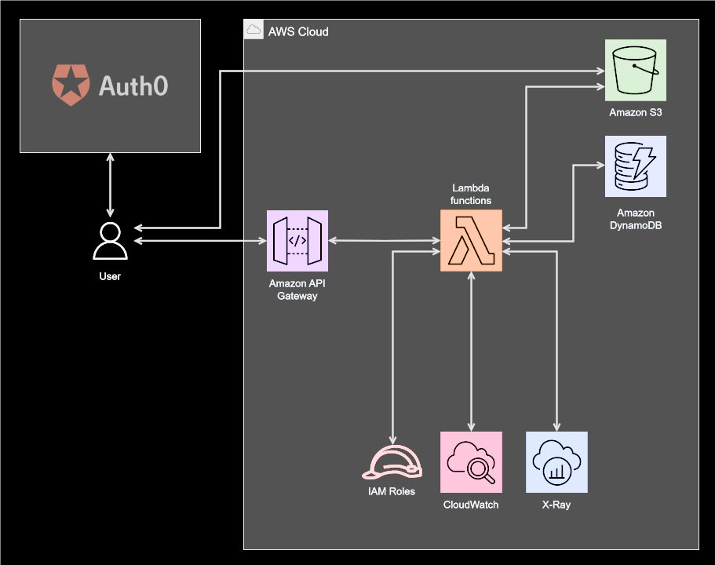
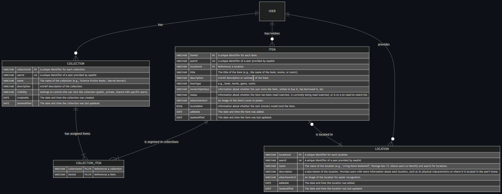

# Serverless Backend

This is the serverless backend for the Collector App.

## Quickstart

### Requirements
* Node version > 18 - check via `node -v`
* Typescript version > 5 - check via `tsc -v`
* Serverless version > 3 - check via `sls -v`

### Commands
```sh
npm i                 # classic install
sls dynamodb install  # installs dynamodb local
sls openapi generate -o collector-openapi.yml -f yaml  # (optional) generates openapi spec
sls print             # prints the compiled and resolved config file
```

🟢 ONLINE
```sh
sls deploy  # deploy serverless template to aws
sls remove  # remove infrastructure and cloudformation template from aws
```

🔴 OFFLINE
```sh
# Execute both commands in seperate terminals:
sls offline         # local deployment hosted on http://localhost:3003
sls dynamodb start  # start dynamodb hosted on http://localhost:8000
```

### How to interact with dynamodb without dynamodbs shell
```sh
aws dynamodb help  # Help
aws dynamodb list-tables --endpoint-url http://localhost:8000  # List all tables
aws dynamodb describe-table --endpoint-url http://localhost:8000 --table-name collector-app-collection-dev  # Describe a table by name (with item count)
```

## Architecture overview

The backend of the Collector App is designed using a serverless architecture on AWS. It provides a REST API via AWS API Gateway, with business logic implemented in Lambda functions. These functions interact with DynamoDB tables and an S3 bucket, using IAM roles for secure access. Some of them are protected and can only be accessed by authenticated users. The entire system is monitored using AWS X-Ray and CloudWatch to ensure performance and reliability.



### Key components and their roles

**AWS API Gateway** is used to expose the Lambda functions as RESTful APIs. It handles the routing of HTTP requests to the appropriate Lambda functions and provides features like request validation and rate limiting.

**AWS Lambda** functions are used to handle the business logic of the application. Each function is triggered by specific events, such as HTTP requests via API Gateway or changes in DynamoDB streams.

**AWS DynamoDB** is used as the primary database for storing collections, items, and locations. The data is organized using tables with composite keys to optimize query performance. The following tables are used:

* `COLLECTION_TABLE`: Stores information about collections.
* `ITEM_TABLE`: Stores information about items.
* `COLLECTION_ITEM_TABLE`: Stores the relationship between collections and items.
* `LOCATION_TABLE`: Stores information about locations.

**AWS S3** is used for storing attachments related to collections and items. It provides scalable and durable storage for files such as images and documents.

**IAM Roles** are used to securely control access to AWS resources. Each Lambda function is assigned a specific role with permissions tailored to its needs, ensuring that functions can only access the resources they require.

**AWS X-Ray** is used for tracing and debugging the application. It helps in monitoring and analyzing the performance of the Lambda functions, providing insights into the execution flow and identifying bottlenecks.

**AWS CloudWatch** is used for logging and monitoring the application. It collects and tracks metrics, collects and monitors log files, and sets alarms. This helps in maintaining the health and performance of the backend services.

**Auth0** is used for authentication and authorization. It provides secure login and registration functionality for the frontend application. Some Lambda functions are protected and can only be accessed by authenticated users.

## Environment Variables
The following environment variables are used in the project:

* `REGION`: AWS region
* `STAGE`: Deployment stage
* `AUTH_0_SECRET_ID`: Auth0 secret ID
* `AUTH_0_SECRET_FIELD`: Auth0 secret field
* `COLLECTION_TABLE`: DynamoDB table for collections
* `COLLECTION_CREATED_AT_INDEX`: Index for collection creation date
* `ITEM_TABLE`: DynamoDB table for items
* `ITEM_CREATED_AT_INDEX`: Index for item creation date
* `COLLECTION_ITEM_TABLE`: DynamoDB table for collection items
* `COLLECTION_ITEM_INDEX`: Index for collection items
* `LOCATION_TABLE`: DynamoDB table for locations
* `LOCATION_ADDED_AT_INDEX`: Index for location addition date
* `ATTACHMENTS_S3_BUCKET`: S3 bucket for attachments
* `SIGNED_URL_EXPIRATION`: Expiration time for signed URLs
* `AWS_NODEJS_CONNECTION_REUSE_ENABLED`: Node.js connection reuse
* `NODE_OPTIONS`: Node.js options

# API documentation

For detailed API documentation, refer to the [OpenApi contract](./contract/).

# Ressources and relationships


see [original .mmd in docs/img](docs/img/er-diagram.mmd)

* **Collection:** Stores information about the items in each user's collection.
* **Item:** Stores information about each item that can be part of a user's collection.
* **CollectionItem:** A list of items (i.e., individual books, movies, comics, etc.) that belong to one or many collections.
* **Location:** Represents the physical locations where collection items can be stored.

### NOT IMPLEMENTED YET ###

The below notes are only ideas and a first draft:
* Lending = Stores information about each lending transaction.
* Tags/Labels = User-defined labels or tags that can be used to categorize and filter items.

**Lending:** Stores information about each lending transaction.
| implemented | name        | description |
|:-----------:|-------------|-------------|
|     ❌     | LendingID    | A unique identifier for each lending transaction. |
|     ❌     | LenderUserID | The identifier of the user who is lending the item. |
|     ❌     | LenderUsername | The name of the user who is lending the item. |
|     ❌     | BorrowerUserID | The identifier of the user who is borrowing the item. |
|     ❌     | BorrowerUsername | The name of the user who is borrowing the item. |
|     ❌     | ItemID       | The identifier of the item being lent. |
|     ❌     | DateLent     | The date when the item was lent. |
|     ❌     | DateReturned | The date when the item was returned. |
|     ❌     | Status       | e.g., lending, returned |

# Test Setup

The current test setup utilizes Postman for API testing. The Postman collection and environment files are located in the [postman](postman) folder.

The collection file `collector-app.postman_collection.json` contains predefined requests for interacting with the backend services, including operations for collections, items, and locations. Two environment files, `DEV collector-app.postman_environment.json` and `LOCAL collector-app.postman_environment.json`, are provided to facilitate testing in different environments.
* `DEV` environment is configured for testing against the deployed AWS infrastructure
* `LOCAL` environment is set up for testing against a local instance running on `http://localhost:3003`

To get started, import the collection and the desired environment into Postman, and execute the requests to validate the API endpoints.

### Authentication

Most of the requests to the backend services require an authentication header. This ensures that only authorized users can access protected resources. To include the authentication header in your requests, follow these steps:

* **Obtain an ID Token**: Use Auth0 to authenticate and obtain an id token. This token will be used to authorize your requests.
* **Include the Authorization Header**: Add the following header to your requests:
    ```
    Authorization: Bearer YOUR_ID_TOKEN
    ```
* **Postman Setup**: In Postman, you can set up the authorization header by navigating to the "Authorization" tab in your request. Select "Bearer Token" as the type and paste your token in the "Token" field.
